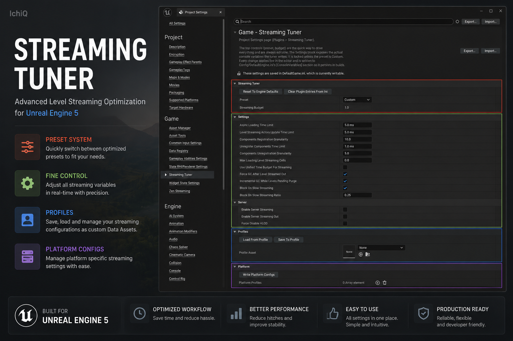

<p align="center">
  
</p>

<h1 align="center">Streaming Tuner</h1>

<p align="center">
  <b>Level streaming budget, dialed in.</b><br>
  One budget dial — plus full manual control — over Unreal Engine's level‑streaming
  console variables, trading game‑thread cost against streaming speed.
</p>

<p align="center">
  
  
  
  
</p>

---

## Overview

Level streaming in Unreal is governed by a scatter of console variables — how many
milliseconds per frame the async loader gets, how large component (un)registration
batches are, whether a forced GC runs on unload, whether the game thread blocks when a
player outruns streaming, and more. Tuning them by hand means digging through docs and
editing `DefaultEngine.ini` by trial and error.

**Streaming Tuner** puts them behind one **Streaming Budget** slider and a set of
ready‑made **profiles**, while still exposing every underlying variable for manual
control. Changes apply live in the editor and are written to `Config/DefaultEngine.ini`,
so they carry into packaged builds.

## Features

- **One budget dial** — a single `0.0 → 1.0` slider maps five time/granularity CVars from a cheap floor up to the engine defaults. Low favours frame stability, high favours streaming speed.
- **Presets** — *Open World*, *Linear Levels*, *Fast Load*, and *Custom*. A preset fills every field; *Custom* unlocks the full settings block for hand tuning.
- **Full per‑CVar control** — every variable the plugin touches is its own field with an inline tooltip (booleans as checkboxes, the rest as numbers).
- **World Partition & unified budget** — includes `wp.Runtime.MaxLoadingLevelStreamingCells` and `s.UseUnifiedTimeBudgetForStreaming` (UE 5.6+).
- **Server section** — dedicated‑server streaming toggles (`EnableServerStreaming`, `EnableServerStreamingOut`, `HLOD.ForceDisable`).
- **Profile data assets** — save configurations as *Streaming Tuner Profile* assets (custom icon, colour and Content Browser category) and load them back into the settings.
- **Per‑platform overrides** — map platforms to profiles and write each into its platform‑specific `Config/<Platform>/<Platform>Engine.ini`.
- **Runtime API** — Blueprint `Pause Tuner` / `Resume Tuner`, plus an automatic pause during first‑launch shader compilation so shaders precache with the full budget.
- **Quality‑of‑life** — *Reset To Engine Defaults* and *Clear Plugin Entries From Ini* buttons, and toast notifications when settings apply.

## Console variables controlled

| Console variable | Exposed as | Purpose |
|---|---|---|
| `s.AsyncLoadingTimeLimit` | Budget | Async loader ms/frame on the game thread |
| `s.LevelStreamingActorsUpdateTimeLimit` | Budget | ms/frame updating streaming‑level actors |
| `s.LevelStreamingComponentsRegistrationGranularity` | Budget | Components registered per batch on stream‑in |
| `s.UnregisterComponentsTimeLimit` | Budget | ms/frame unregistering components on stream‑out |
| `s.LevelStreamingComponentsUnregistrationGranularity` | Budget | Components unregistered per batch on stream‑out |
| `s.UseUnifiedTimeBudgetForStreaming` | Toggle | Share one frame budget between loading and streaming (UE 5.6+) |
| `wp.Runtime.MaxLoadingLevelStreamingCells` | Number | Cap on concurrently loading World Partition cells (0 = unlimited) |
| `s.ForceGCAfterLevelStreamedOut` | Toggle | Forced GC pass after a level unloads |
| `s.ContinuouslyIncrementalGCWhileLevelsPendingPurge` | Toggle | Incremental GC while levels wait to be purged |
| `wp.Runtime.BlockOnSlowStreaming` | Toggle | Stall the game thread when the player outruns streaming |
| `wp.Runtime.BlockOnSlowStreamingRatio` | Number | Distance ratio at which blocking kicks in (−1 disables) |
| `wp.Runtime.EnableServerStreaming` | Server | Stream cells on a dedicated server |
| `wp.Runtime.EnableServerStreamingOut` | Server | Also unload unneeded cells on the server |
| `wp.Runtime.HLOD.ForceDisable` | Server | Skip HLOD generation/loading (server) |

> Exact defaults and availability can vary between engine builds; type the `s.` / `wp.Runtime.` prefix in the console to confirm what exists in your version.

## Requirements

- Unreal Engine **5.8** (targets Win64 / Mac).
- A **C++ project** (or the ability to compile plugins) — this is a source plugin.

## Installation

1. Copy the `StreamingTuner` folder into your project's `Plugins/` directory
   (create it if needed): `YourProject/Plugins/StreamingTuner`.
2. Right‑click your `.uproject` → **Generate Visual Studio project files**.
3. Open the project and build when prompted (or build from your IDE).
4. Enable it under **Edit → Plugins → Optimization → Streaming Tuner** if it isn't already.

## Usage

### Settings

Open **Project Settings → Plugins → Streaming Tuner**.

- **Preset** — pick a profile for a one‑click baseline, or **Custom** to edit everything.
- **Streaming Budget** — the coarse dial; drives the five time/granularity fields.
- **Settings** — the raw console variables. Locked while a preset is active, editable in *Custom*.
- **Settings ▸ Server** — dedicated‑server streaming toggles.
- **Profiles** — assign a *Streaming Tuner Profile* asset and use **Load From Profile** / **Save To Profile**.
- **Per‑Platform** — add rows of `{ Platform, Profile }` and click **Write Per‑Platform Configs**.
- **Reset To Engine Defaults** / **Clear Plugin Entries From Ini** — restore defaults or clean the plugin's entries out of `DefaultEngine.ini` for a tidy uninstall.

### Profiles

Create one via **Content Browser → right‑click → Streaming Tuner → Streaming Tuner Profile**.
Edit its values, then load it into the settings or reference it from a per‑platform row.

### Runtime (Blueprint)

`Pause Tuner` caches the current values and restores engine defaults; `Resume Tuner`
re‑applies them — useful around heavy startup work. The plugin also pauses itself
automatically while shaders precache at first launch, resuming a few seconds after the
work goes idle.

## How it works

Changing a value sets the console variable live (in editor) and writes it to the
`[ConsoleVariables]` section of `Config/DefaultEngine.ini`, which the engine applies at
startup — so tuned values persist into packaged builds. Per‑platform overrides are
written to `Config/<Platform>/<Platform>Engine.ini`, layering only on that platform.

## Project structure

```
StreamingTuner/
├─ StreamingTuner.uplugin
├─ Resources/                     # icons, thumbnail, cover
└─ Source/
   ├─ StreamingTunerRuntime/      # CVar registry, values struct, profile asset, BP API, shader‑aware pause
   └─ StreamingTunerEditor/       # settings page, details customization, asset factory & definition, styling
```

## Compatibility

Built and tested against Unreal Engine 5.8. To support additional engine versions, set
the matching `EngineVersion` in `StreamingTuner.uplugin` and rebuild.

## Contributing

Issues and pull requests are welcome. For bug reports, please include the engine version
and reproduction steps.

## License

See [`LICENSE`](LICENSE).

## Author

**Aleksey Karpov** (**IchiQ**)

<sub>Copyright © 2026 Aleksey Karpov (IchiQ). All Rights Reserved.</sub>
